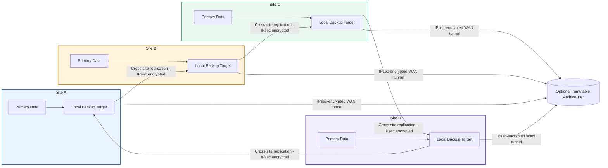

# Backup and DR Flow

```mermaid
graph LR
  subgraph SA[Site A]
    A1[Primary Data]
    AB[Local Backup Target]
  end

  subgraph SB[Site B]
    B1[Primary Data]
    BB[Local Backup Target]
  end

  subgraph SC[Site C]
    C1[Primary Data]
    CB[Local Backup Target]
  end

  subgraph SD[Site D]
    D1[Primary Data]
    DB[Local Backup Target]
  end

  IMM[(Optional Immutable Archive Tier)]

  A1 --> AB
  B1 --> BB
  C1 --> CB
  D1 --> DB

  AB -->|Cross-site replication - IPsec encrypted| BB
  BB -->|Cross-site replication - IPsec encrypted| CB
  CB -->|Cross-site replication - IPsec encrypted| DB
  DB -->|Cross-site replication - IPsec encrypted| AB

  AB -->|IPsec-encrypted WAN tunnel| IMM
  BB -->|IPsec-encrypted WAN tunnel| IMM
  CB -->|IPsec-encrypted WAN tunnel| IMM
  DB -->|IPsec-encrypted WAN tunnel| IMM

  style SA fill:#EAF4FF,stroke:#2E6DA4,stroke-width:2px,color:#111111
  style SB fill:#FFF4DB,stroke:#A56A00,stroke-width:2px,color:#111111
  style SC fill:#EAF8EF,stroke:#2F855A,stroke-width:2px,color:#111111
  style SD fill:#F2EDFF,stroke:#6B46C1,stroke-width:2px,color:#111111
```
