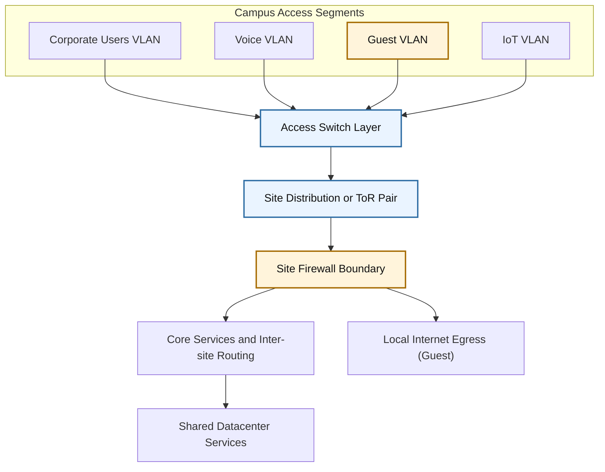

# Campus Network Topology

Reference campus topology showing access segments, site distribution, and policy boundaries.

```mermaid
flowchart TD
  subgraph USERS["Campus Access Segments"]
    CORP["Corporate Users VLAN"]
    VOICE["Voice VLAN"]
    GUEST["Guest VLAN"]
    IOT["IoT VLAN"]
  end

  CORP --> ACCESS["Access Switch Layer"]
  VOICE --> ACCESS
  GUEST --> ACCESS
  IOT --> ACCESS

  ACCESS --> DIST["Site Distribution or ToR Pair"]
  DIST --> FW["Site Firewall Boundary"]
  FW --> CORE["Core Services and Inter-site Routing"]

  FW --> INET["Local Internet Egress (Guest)"]
  CORE --> SHARED["Shared Datacenter Services"]

  style ACCESS fill:#EAF4FF,stroke:#2E6DA4,stroke-width:2px,color:#111111
  style DIST fill:#EAF4FF,stroke:#2E6DA4,stroke-width:2px,color:#111111
  style FW fill:#FFF4DB,stroke:#A56A00,stroke-width:2px,color:#111111
  style GUEST fill:#FFF4DB,stroke:#A56A00,stroke-width:2px,color:#111111
  linkStyle default color:#CC5500
```
