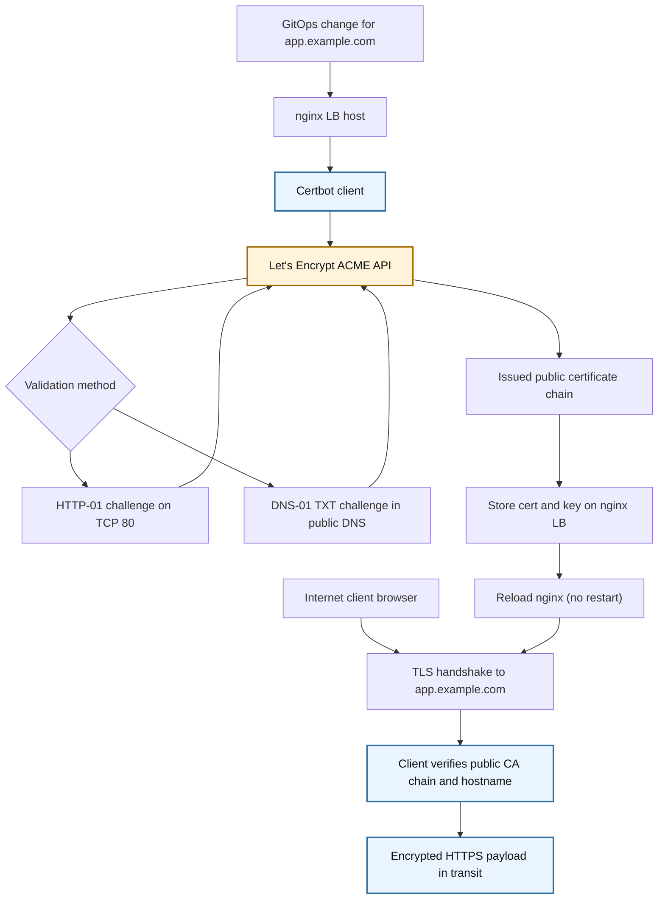

# Certbot and Public PKI Flow

How Certbot automates certificate lifecycle for internet-accessible published applications.

```mermaid
flowchart TD
  ADMIN["GitOps change for app.example.com"] --> LB["nginx LB host"]
  LB --> CERTBOT["Certbot client"]

  CERTBOT --> ACME["Let's Encrypt ACME API"]
  ACME --> CHAL{"Validation method"}
  CHAL --> HTTP["HTTP-01 challenge on TCP 80"]
  CHAL --> DNS["DNS-01 TXT challenge in public DNS"]

  HTTP --> ACME
  DNS --> ACME

  ACME --> ISSUED["Issued public certificate chain"]
  ISSUED --> STORE["Store cert and key on nginx LB"]
  STORE --> RELOAD["Reload nginx (no restart)"]

  CLIENT["Internet client browser"] --> TLS["TLS handshake to app.example.com"]
  TLS --> VERIFY["Client verifies public CA chain and hostname"]
  VERIFY --> E2E["Encrypted HTTPS payload in transit"]

  RELOAD --> TLS

  style CERTBOT fill:#EAF4FF,stroke:#2E6DA4,stroke-width:2px,color:#111111
  style ACME fill:#FFF4DB,stroke:#A56A00,stroke-width:2px,color:#111111
  style VERIFY fill:#EAF4FF,stroke:#2E6DA4,stroke-width:2px,color:#111111
  style E2E fill:#EAF4FF,stroke:#2E6DA4,stroke-width:2px,color:#111111
  linkStyle default color:#CC5500
```
