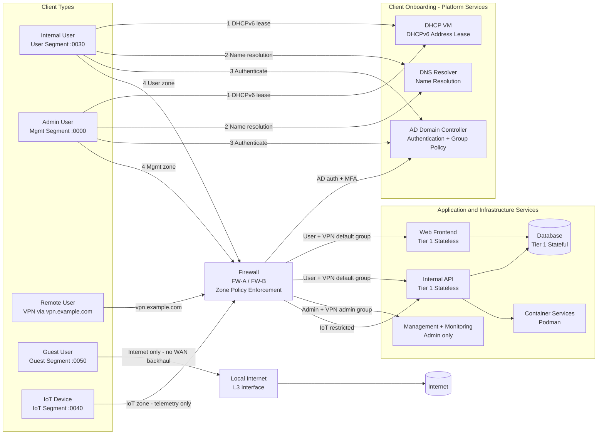

# Client and Service Interactions

Shows how each client type enters the environment, onboards through platform services, passes through the site firewall, and reaches permitted application services. Applies per-site and for VPN-connected remote users.

## Client Access Summary

| Client Type | Entry Point | Onboarding | Permitted Services |
|---|---|---|---|
| Internal User | User segment direct | DHCP, DNS, AD auth | Web frontend, Internal API |
| Admin User | Mgmt segment direct | DHCP, DNS, AD auth | All services including Management |
| Remote User (VPN) | `vpn.example.com` + MFA | AD auth at FW | Web frontend, Internal API (default); Management if admin group |
| Guest User | Guest segment | None | Internet only via local L3 breakout |
| IoT Device | IoT segment | None | Internal API telemetry endpoint only |

## Onboarding Sequence for Internal Clients

1. **DHCP** — Client receives a DHCPv6 address reservation from the site DHCP VM. Address is in the appropriate segment for the client type.
2. **DNS** — Client resolves service FQDNs against the local DNS resolver. Resolver is reachable via anycast or site-local address.
3. **AD Authentication** — Client authenticates against the site AD domain controller. Group membership is evaluated and passed to the firewall for zone policy decisions.
4. **Service Access** — Firewall permits traffic based on zone and AD group. All flows are statefully inspected.
