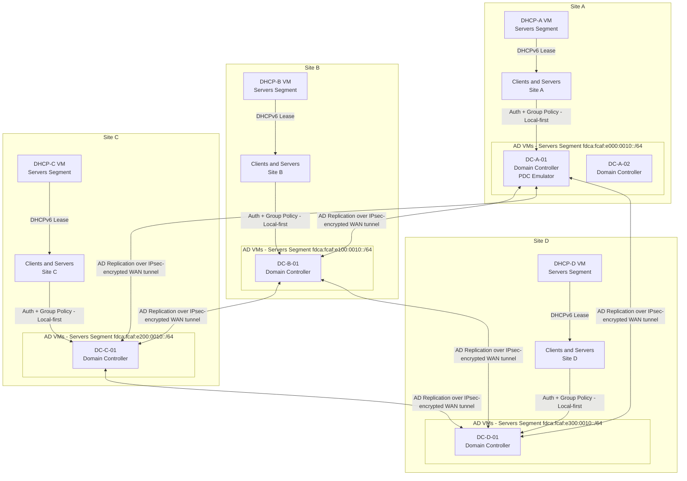

# DHCP and Active Directory Services

AD Domain Controllers run as dedicated VMs on the hypervisor cluster at each site.
DHCP VMs serve DHCPv6 reservations to infrastructure clients within each site.
Clients and servers authenticate against the local DC first; cross-site DC access is available over IPsec-encrypted WAN tunnels for resilience.

## Design Notes

- Site A runs two AD DCs for quorum and FSMO role resilience (PDC Emulator on DC-A-01).
- Sites B, C, and D each run one DC; add a second DC per site to match Site A redundancy if capacity allows.
- All DC VMs are placed in the Servers/VMs segment (`:0010`) at each site, consistent with the IPv6 addressing plan.
- DHCP VMs issue DHCPv6 reservations rather than dynamic SLAAC, per the addressing plan guidance.
- AD replication topology is full-mesh across all four sites. All replication traffic is encrypted inside IPsec tunnels between site edge pairs; it does not traverse the WAN in plaintext.
- Local DC is the preferred authentication target; cross-site DC fallback is available if the local DC is unreachable.
- AD VMs are classified as Tier 1 Stateful services under the services spanning model.
