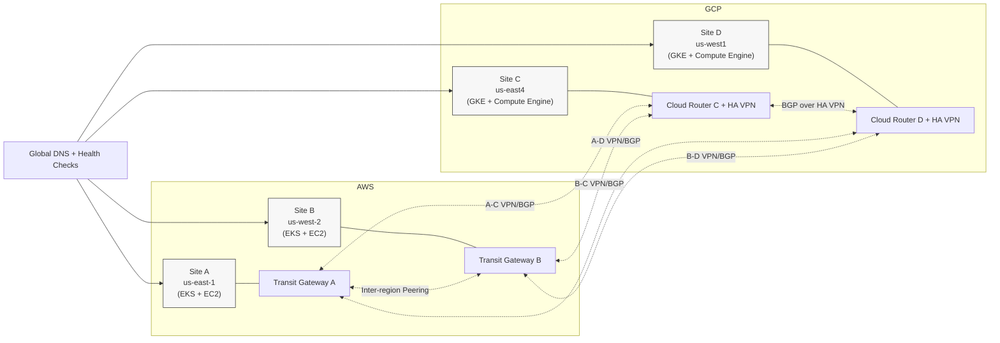

# Dual-Cloud 4-Site Topology

## Routing Intent
- East preferred path: Site A <-> Site C.
- West preferred path: Site B <-> Site D.
- Cross-paths (A-D, B-C) remain ready for policy-driven failover.
- Advertise only summarized site prefixes for both IPv6 and IPv4 families.
