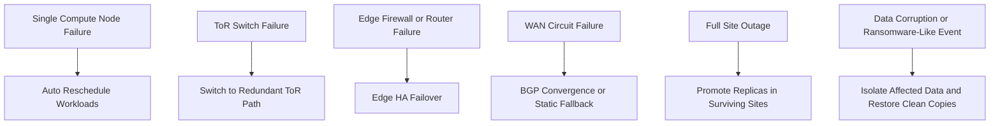

# Failover Matrix

```mermaid
graph TD
  F1[Single Compute Node Failure]
  F2[ToR Switch Failure]
  F3[Edge Firewall or Router Failure]
  F4[WAN Circuit Failure]
  F5[Full Site Outage]
  F6[Data Corruption or Ransomware-Like Event]

  R1[Auto Reschedule Workloads]
  R2[Switch to Redundant ToR Path]
  R3[Edge HA Failover]
  R4[BGP Convergence or Static Fallback]
  R5[Promote Replicas in Surviving Sites]
  R6[Isolate Affected Data and Restore Clean Copies]

  F1 --> R1
  F2 --> R2
  F3 --> R3
  F4 --> R4
  F5 --> R5
  F6 --> R6
  linkStyle default color:#CC5500
```
