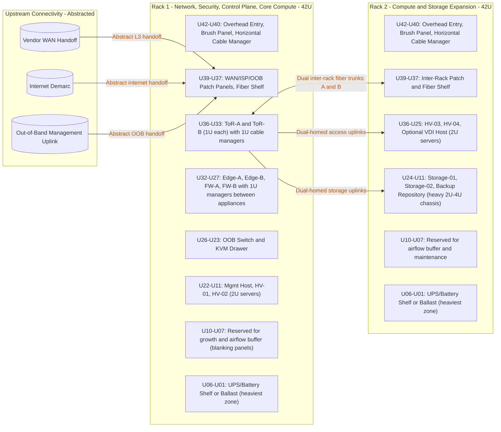
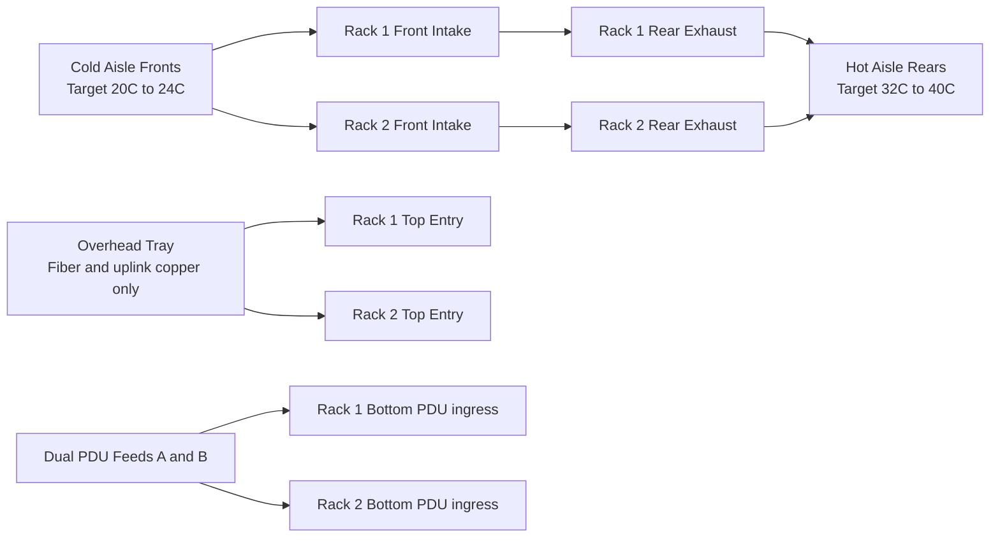

# Physical Rack Topology (Two-Rack Site)

This diagram set defines a practical two-rack physical layout for one site.
It keeps upstream connectivity abstracted while making device placement, cable paths, and airflow controls explicit.

## Rack Elevation and Upstream Connectivity (Abstracted)

## Cold Aisle / Hot Aisle Airflow and Cable Lanes

## Detailed 42U Layout Guidance

### Rack 1 (Network + Security + Core Compute)

| RU range | Equipment block | Weight profile | Mounting and orientation | Airflow direction | Cable management |
| --- | --- | --- | --- | --- | --- |
| U42-U40 | Brush panel + cable manager | Light | Top entry for overhead tray handoff | Passive | Keep fiber/copper entry strain-relieved |
| U39-U37 | Patch panels + fiber shelf | Light | Front serviceable, labeled left-to-right | Passive | Keep WAN/ISP/OOB patching short and labeled |
| U36-U33 | ToR-A, ToR-B + 1U managers | Medium | Rails square and level, ports facing service side | Front-to-back | 1U manager between switches, short DAC/AOC runs |
| U32-U27 | Edge-A, Edge-B, FW-A, FW-B + managers | Medium | Alternate appliance and manager for service access | Front-to-back | Keep uplinks in right-side data lane, no cross-face drape |
| U26-U23 | OOB switch + KVM drawer | Light | Front-access controls | Front-to-back | OOB copper to dedicated patch block |
| U22-U11 | Mgmt host, HV-01, HV-02 | Heavy-medium | Use fixed rails and rear support brackets | Front-to-back | Separate server NIC bundles by ToR A/B path |
| U10-U07 | Reserved blanking zone | None | Fill with blanking panels | Maintains pressure | No loose slack loops |
| U06-U01 | UPS/battery shelf or ballast | Heaviest | Bottom-most to lower center of gravity | Front-to-back if fan-assisted | Power enters from rear vertical lanes only |

### Rack 2 (Compute + Storage Expansion)

| RU range | Equipment block | Weight profile | Mounting and orientation | Airflow direction | Cable management |
| --- | --- | --- | --- | --- | --- |
| U42-U40 | Brush panel + cable manager | Light | Top entry for inter-rack trunks | Passive | Keep trunks bundled by path A/B |
| U39-U37 | Inter-rack patch + fiber shelf | Light | Front patching and clear labeling | Passive | Fiber on top tray, copper below in same manager |
| U36-U25 | HV-03, HV-04, optional VDI host | Medium-heavy | Rails with rear brackets; even side loading | Front-to-back | Dual-home each host to both ToRs |
| U24-U11 | Storage-01, Storage-02, backup repo | Heavy | Keep deepest/heaviest chassis lower in this block | Front-to-back | Use short, direct storage fabric runs |
| U10-U07 | Reserved blanking zone | None | Fill with blanking panels | Maintains pressure | Hold only service slack, no large coils |
| U06-U01 | UPS/battery shelf or ballast | Heaviest | Bottom-most to reduce tip risk | Front-to-back if fan-assisted | Separate power A/B feeds on opposite vertical PDUs |

## Physical Rules (Mandatory)

- Mount all active gear for front intake from cold aisle and rear exhaust to hot aisle.
- Do not mix side-to-side airflow appliances without baffles or airflow adapters.
- Keep heavy equipment in lower third of rack (roughly U14 and below), with the heaviest at U06-U01.
- Maintain front and rear service clearance of at least 1000 mm where possible.
- Install blanking panels in every unused RU inside active equipment zones.
- Reserve at least 15 percent free RU per rack for thermal stability and growth.
- Separate power and data pathways:
  power on rear vertical managers and PDUs, data in overhead tray and horizontal managers.
- Keep fiber bend radius and copper bend radius within vendor limits; avoid hard 90-degree bends.
- Use two physically separated inter-rack trunks (Path A and Path B) to avoid single-cable failure domains.

## Airflow Quality Targets

- Cold aisle inlet: 20C to 24C target range.
- Relative humidity: 40 percent to 60 percent.
- Rack delta-T (front intake to rear exhaust): typically 10C to 15C.
- No persistent hotspot above 27C at any server intake sensor.
- Investigate immediately if top-of-rack exhaust exceeds 40C for sustained periods.
