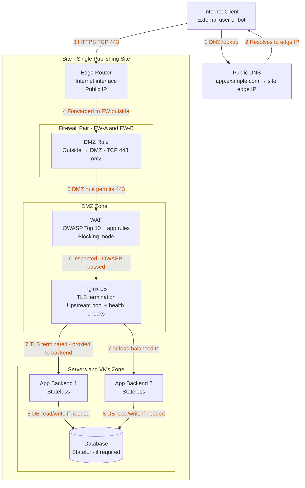
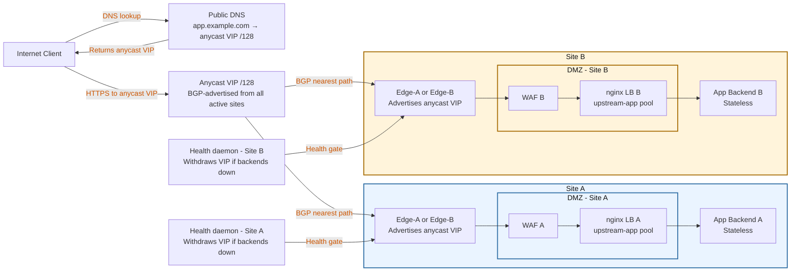
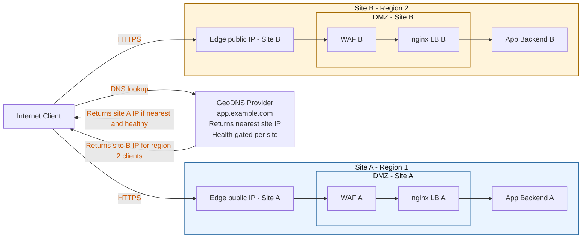
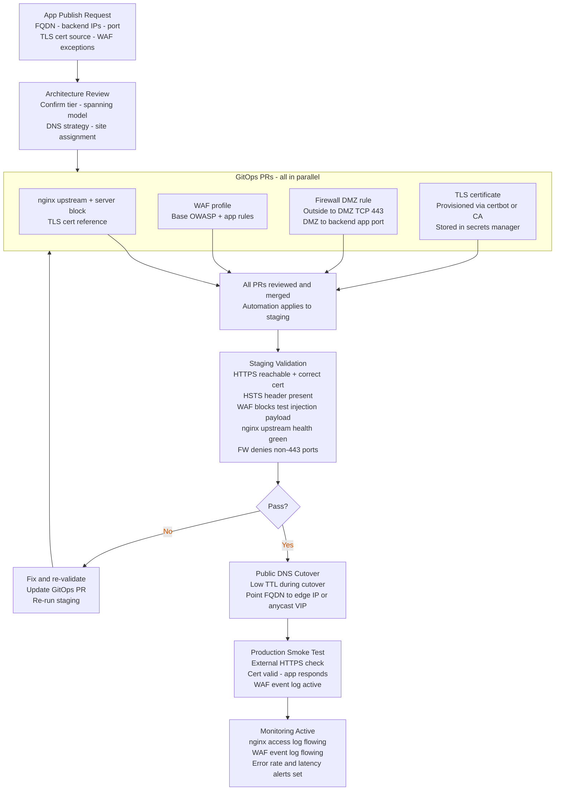
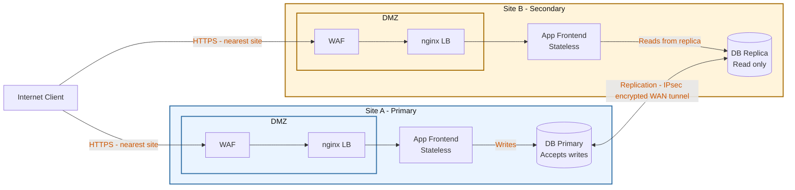

# Published Application Diagrams

## Single-Site Traffic Flow

Inbound internet request reaching a published app at one site, traversing the full DMZ stack.

## Multi-Site Anycast Flow

Stateless app published at multiple sites behind a shared anycast ingress VIP. BGP selects the nearest site.

## Multi-Site GeoDNS Flow

Alternative to anycast. DNS provider returns the nearest site's IP based on client geography.

## App Publish Workflow

Steps from request to live service. All configuration changes flow through GitOps — no manual changes on production systems.

## Full-Stack App with Stateful DB

Stateless frontend published externally, write DB single-site, read replicas at secondary sites.

