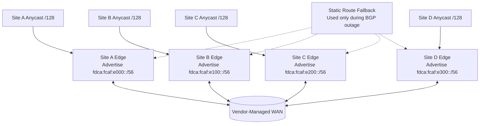

# BGP Routing and Prefix Advertisement

```mermaid
graph TD
  WAN[(Vendor-Managed WAN)]

  A["Site A Edge<br/>Advertise fdca:fcaf:e000::/56"]
  B["Site B Edge<br/>Advertise fdca:fcaf:e100::/56"]
  C["Site C Edge<br/>Advertise fdca:fcaf:e200::/56"]
  D["Site D Edge<br/>Advertise fdca:fcaf:e300::/56"]

  ANYA[Site A Anycast /128]
  ANYB[Site B Anycast /128]
  ANYC[Site C Anycast /128]
  ANYD[Site D Anycast /128]

  A <--> WAN
  B <--> WAN
  C <--> WAN
  D <--> WAN

  ANYA --> A
  ANYB --> B
  ANYC --> C
  ANYD --> D

  FALLBACK["Static Route Fallback<br/>Used only during BGP outage"]
  FALLBACK -.-> A
  FALLBACK -.-> B
  FALLBACK -.-> C
  FALLBACK -.-> D
```
