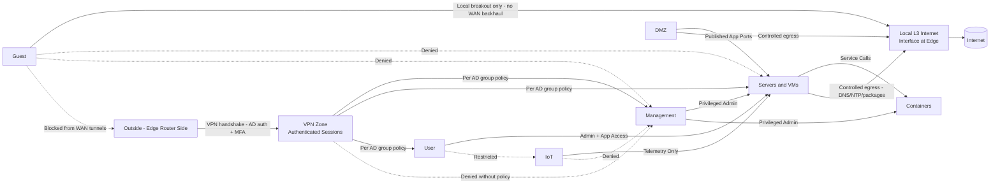

# Segmentation and Allowed Flows

All zone enforcement is performed by FW-A / FW-B. Default deny between all zones.

```mermaid
graph LR
  OUTSIDE["Outside - Edge Router Side"]
  VPN["VPN Zone<br/>Authenticated Sessions"]
  MGMT[Management]
  SRV[Servers and VMs]
  CTR[Containers]
  USR[User]
  IOT[IoT]
  GST[Guest]
  DMZ[DMZ]
  INT[(Internet)]
  L3OUT["Local L3 Internet<br/>Interface at Edge"]

  OUTSIDE -->|VPN handshake - AD auth + MFA| VPN
  VPN -->|Per AD group policy| MGMT
  VPN -->|Per AD group policy| SRV
  VPN -->|Per AD group policy| USR

  USR -->|Admin + App Access| SRV
  SRV -->|Service Calls| CTR
  DMZ -->|Published App Ports| SRV
  MGMT -->|Privileged Admin| SRV
  MGMT -->|Privileged Admin| CTR
  IOT -->|Telemetry Only| SRV
  GST -->|Local breakout only - no WAN backhaul| L3OUT
  L3OUT --> INT
  SRV -->|Controlled egress - DNS/NTP/packages| L3OUT
  DMZ -->|Controlled egress| L3OUT

  GST -.Denied.-> SRV
  GST -.Denied.-> MGMT
  GST -.Blocked from WAN tunnels.-> OUTSIDE
  IOT -.Denied.-> MGMT
  USR -.Restricted.-> IOT
  VPN -.Denied without policy.-> MGMT
```
