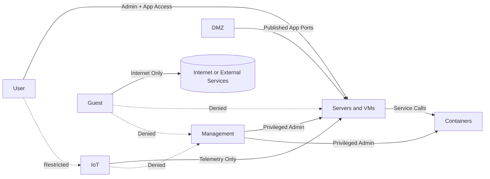

# Segmentation and Allowed Flows

```mermaid
graph LR
  MGMT[Management]
  SRV[Servers and VMs]
  CTR[Containers]
  USR[User]
  IOT[IoT]
  GST[Guest]
  DMZ[DMZ]
  INT[(Internet or External Services)]

  USR -->|Admin + App Access| SRV
  SRV -->|Service Calls| CTR
  DMZ -->|Published App Ports| SRV
  MGMT -->|Privileged Admin| SRV
  MGMT -->|Privileged Admin| CTR
  IOT -->|Telemetry Only| SRV
  GST -->|Internet Only| INT

  GST -.Denied.-> SRV
  GST -.Denied.-> MGMT
  IOT -.Denied.-> MGMT
  USR -.Restricted.-> IOT
```
