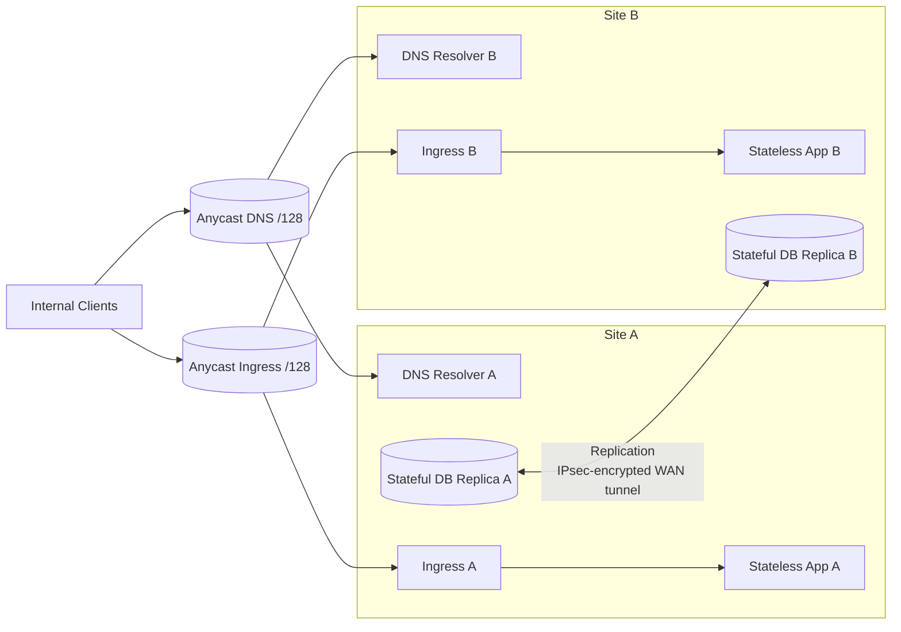

# Services and Optional Anycast

```mermaid
graph LR
  U[Internal Clients]
  DNSA[(Anycast DNS /128)]
  ING[(Anycast Ingress /128)]

  subgraph S1[Site A]
    DNS1[DNS Resolver A]
    IN1[Ingress A]
    APP1[Stateless App A]
    DB1[(Stateful DB Replica A)]
  end

  subgraph S2[Site B]
    DNS2[DNS Resolver B]
    IN2[Ingress B]
    APP2[Stateless App B]
    DB2[(Stateful DB Replica B)]
  end

  U --> DNSA
  U --> ING

  DNSA --> DNS1
  DNSA --> DNS2
  ING --> IN1
  ING --> IN2

  IN1 --> APP1
  IN2 --> APP2

  DB1 <-->|Replication\nIPsec-encrypted WAN tunnel| DB2
```
