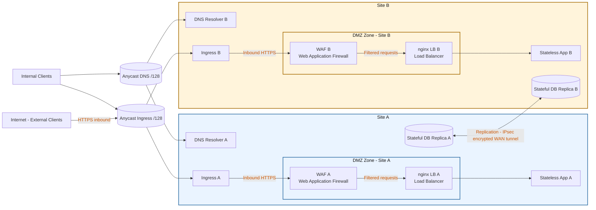

# Services and Optional Anycast

```mermaid
graph LR
  U[Internal Clients]
  INET[Internet - External Clients]
  DNSA[(Anycast DNS /128)]
  ING[(Anycast Ingress /128)]

  subgraph S1[Site A]
    DNS1[DNS Resolver A]
    IN1[Ingress A]
    subgraph DMZ1[DMZ Zone - Site A]
      WAF1["WAF A<br/>Web Application Firewall"]
      LB1["nginx LB A<br/>Load Balancer"]
    end
    APP1[Stateless App A]
    DB1[(Stateful DB Replica A)]
  end

  subgraph S2[Site B]
    DNS2[DNS Resolver B]
    IN2[Ingress B]
    subgraph DMZ2[DMZ Zone - Site B]
      WAF2["WAF B<br/>Web Application Firewall"]
      LB2["nginx LB B<br/>Load Balancer"]
    end
    APP2[Stateless App B]
    DB2[(Stateful DB Replica B)]
  end

  U --> DNSA
  U --> ING
  INET -->|HTTPS inbound| ING

  DNSA --> DNS1
  DNSA --> DNS2
  ING --> IN1
  ING --> IN2

  IN1 -->|Inbound HTTPS| WAF1
  WAF1 -->|Filtered requests| LB1
  LB1 --> APP1

  IN2 -->|Inbound HTTPS| WAF2
  WAF2 -->|Filtered requests| LB2
  LB2 --> APP2

  DB1 <-->|Replication - IPsec encrypted WAN tunnel| DB2

  style S1 fill:#EAF4FF,stroke:#2E6DA4,stroke-width:2px,color:#111111
  style DMZ1 fill:#EAF4FF,stroke:#2E6DA4,stroke-width:2px,color:#111111
  style S2 fill:#FFF4DB,stroke:#A56A00,stroke-width:2px,color:#111111
  style DMZ2 fill:#FFF4DB,stroke:#A56A00,stroke-width:2px,color:#111111
  linkStyle default color:#CC5500
```
