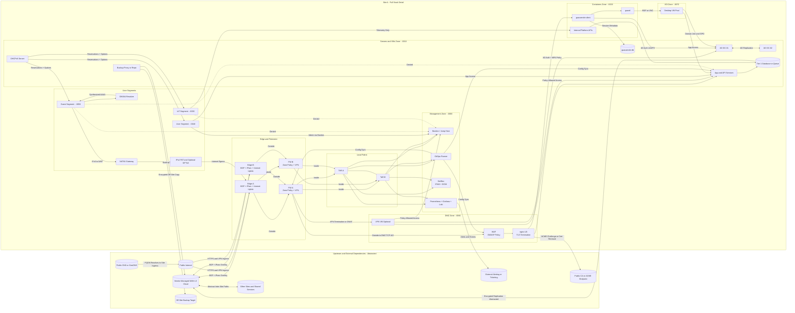

# One-Site Full Stack (Upstream Abstracted)

Single-site deep-dive view of edge, zones, platform services, and data paths.
Upstream dependencies are intentionally abstracted to keep focus on the site architecture.

## Notes

- This diagram is intentionally single-site and exhaustive, while WAN/internet/provider details remain abstracted.
- All east-west and north-south policy enforcement is performed by the site firewall pair.
- Local internet breakout, NAT64, and PAT/NPTv6 behavior are shown as site-local functions.
