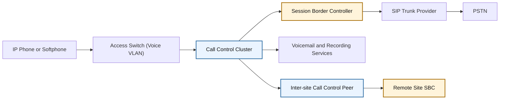

# Telephony Service Flow

Reference flow for enterprise telephony from endpoint registration through PSTN routing.

```mermaid
flowchart LR
  PHONE["IP Phone or Softphone"] --> ACCESS["Access Switch (Voice VLAN)"]
  ACCESS --> CALL["Call Control Cluster"]
  CALL --> SBC["Session Border Controller"]
  SBC --> SIP["SIP Trunk Provider"]
  SIP --> PSTN["PSTN"]

  CALL --> VM["Voicemail and Recording Services"]
  CALL --> PEER["Inter-site Call Control Peer"]
  PEER --> SBC2["Remote Site SBC"]

  style CALL fill:#EAF4FF,stroke:#2E6DA4,stroke-width:2px,color:#111111
  style SBC fill:#FFF4DB,stroke:#A56A00,stroke-width:2px,color:#111111
  style PEER fill:#EAF4FF,stroke:#2E6DA4,stroke-width:2px,color:#111111
  style SBC2 fill:#FFF4DB,stroke:#A56A00,stroke-width:2px,color:#111111
  linkStyle default color:#CC5500
```
