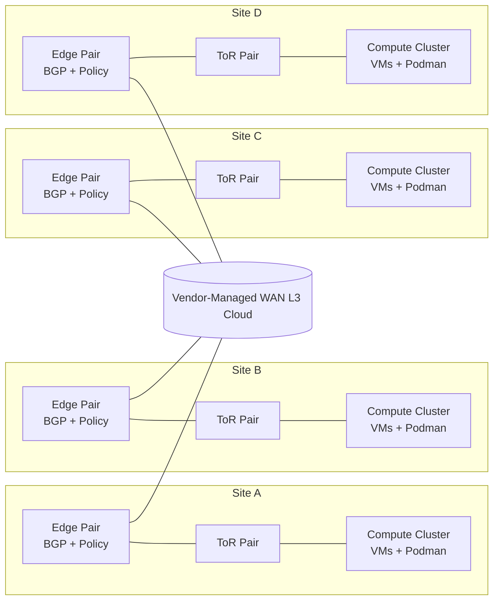

# Global Topology

```mermaid
graph LR
  WAN[(Vendor-Managed WAN L3 Cloud)]

  subgraph SA[Site A]
    SAE["Edge Pair<br/>BGP + Policy"]
    SAT[ToR Pair]
    SAC["Compute Cluster<br/>VMs + Podman"]
  end

  subgraph SB[Site B]
    SBE["Edge Pair<br/>BGP + Policy"]
    SBT[ToR Pair]
    SBC["Compute Cluster<br/>VMs + Podman"]
  end

  subgraph SC[Site C]
    SCE["Edge Pair<br/>BGP + Policy"]
    SCT[ToR Pair]
    SCC["Compute Cluster<br/>VMs + Podman"]
  end

  subgraph SD[Site D]
    SDE["Edge Pair<br/>BGP + Policy"]
    SDT[ToR Pair]
    SDC["Compute Cluster<br/>VMs + Podman"]
  end

  SAE --- WAN
  SBE --- WAN
  SCE --- WAN
  SDE --- WAN

  SAE --- SAT --- SAC
  SBE --- SBT --- SBC
  SCE --- SCT --- SCC
  SDE --- SDT --- SDC
```
