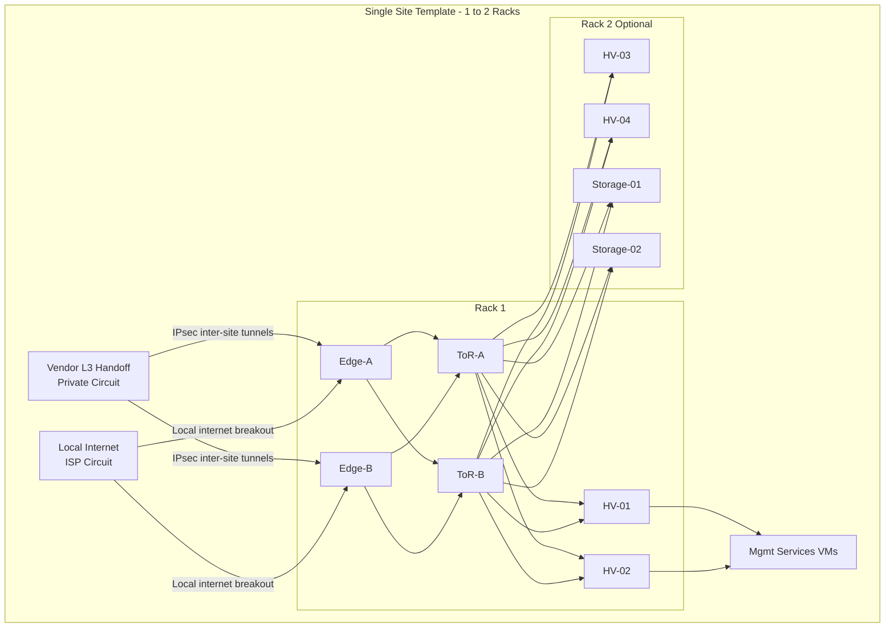

# Per-Site Logical Rack Topology

Standard site template. The designated redundant internet site uses two separate ISP circuits (ISP-1 on Edge-A, ISP-2 on Edge-B) instead of a single shared circuit.

