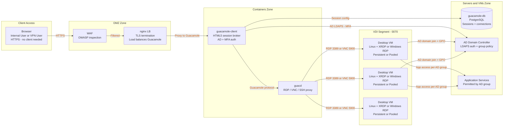
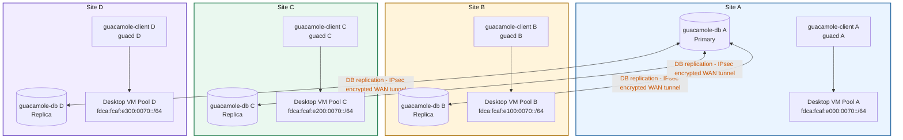
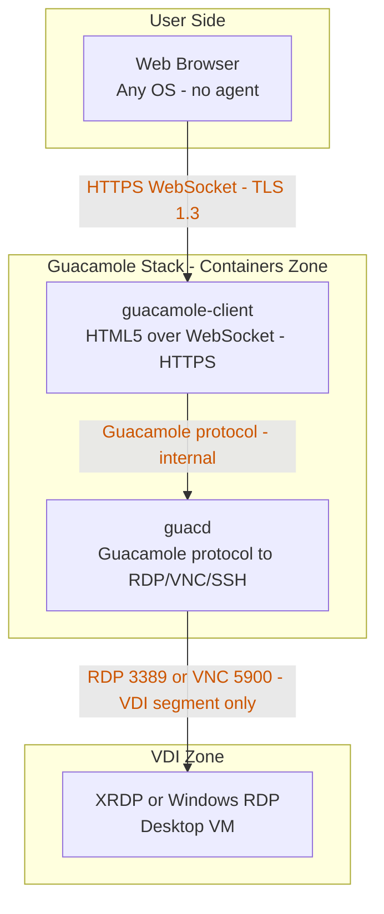
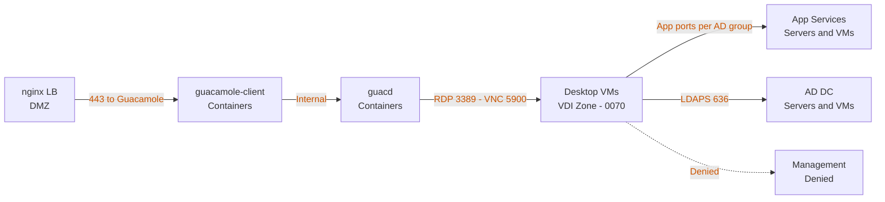

# VDI Service Architecture

## Full Access Path

Shows how a user browser session reaches a desktop VM through the open-source Guacamole stack, and how desktop VMs interact with backend services and identity.

## Multi-Site Spanning

Each site runs its own Guacamole stack and local desktop VM pool. Session database replicates cross-site for failover.

## Protocol Stack

## Firewall Zone Policy Summary

