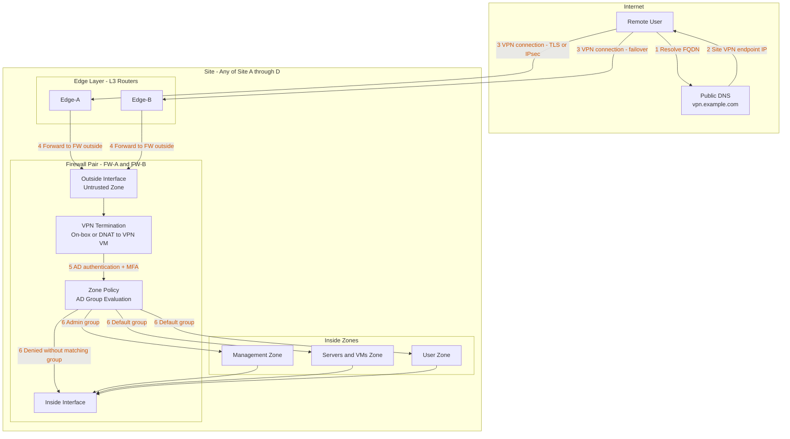

# Remote Access VPN Flow

Remote users connect to `vpn.example.com`, which resolves to the VPN endpoint IP at each site. VPN terminates on the site firewall appliance (FW-A / FW-B) or via DNAT to a dedicated VPN VM in the DMZ zone. Authenticated sessions are placed in the VPN zone and permitted to inside segments per AD group policy.

## Design Notes

- `vpn.example.com` is a placeholder FQDN. Replace with the actual public DNS name at implementation.
- Per-site DNS records or GeoDNS can route clients to the nearest available site automatically.
- VPN deployment options:
  - **Option A (preferred):** VPN terminates directly on the firewall appliance. Supported by most commercial and open-source firewall platforms with SSL-VPN or IPsec remote access.
  - **Option B:** Firewall DNATs inbound VPN traffic to a dedicated VPN VM (`site-a-vpn-01`) in the DMZ zone. Allows use of a separate VPN platform (e.g., WireGuard server, OpenVPN) without requiring the firewall to support on-box VPN.
- MFA is enforced at the VPN gateway in both options. AD integration provides group-based zone access.
- Split tunnelling is disabled by default. All client traffic routes through the tunnel.
- VPN sessions from all sites authenticate against the local site AD domain controller. AD replication ensures consistent group membership across sites.
