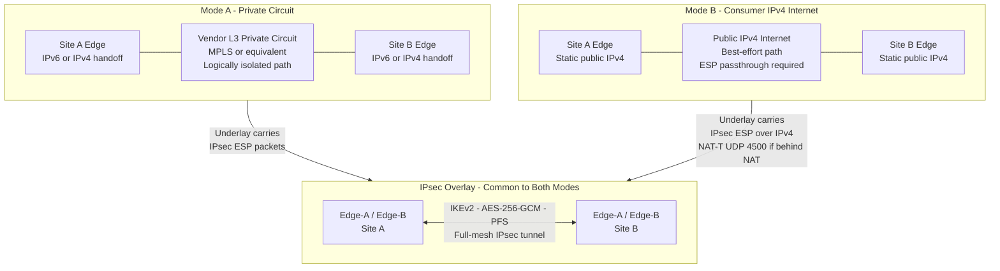
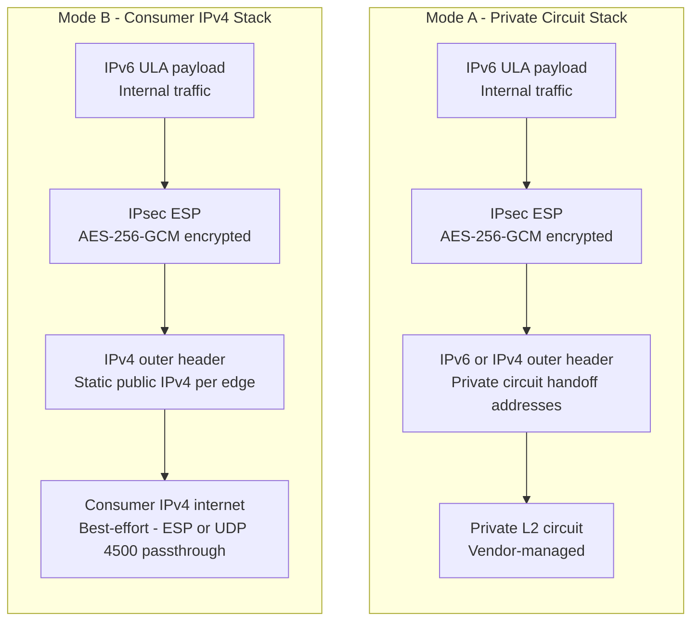
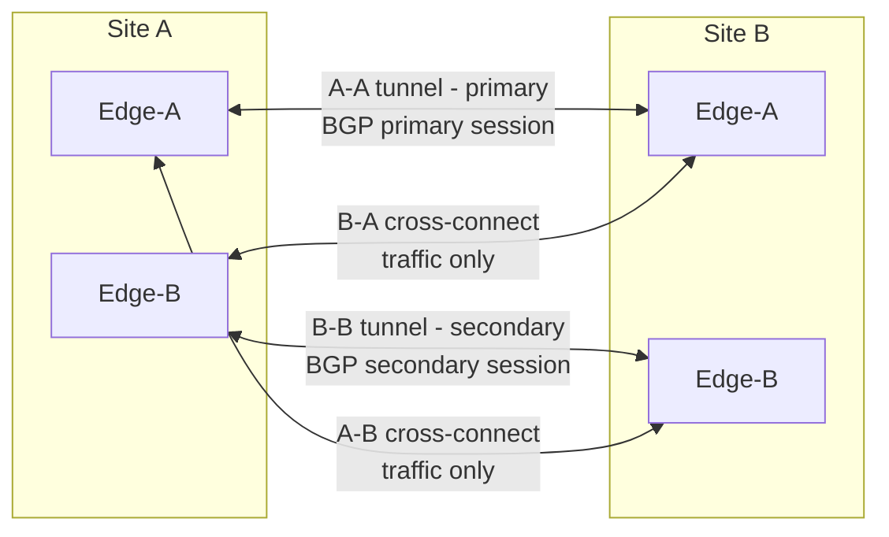
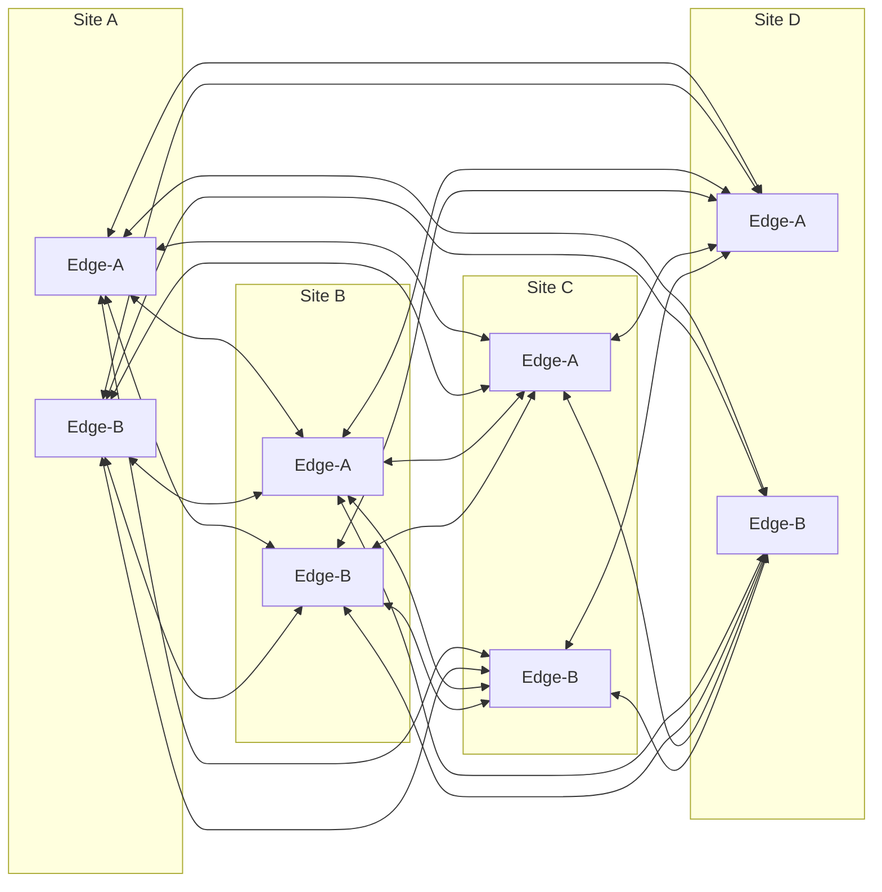
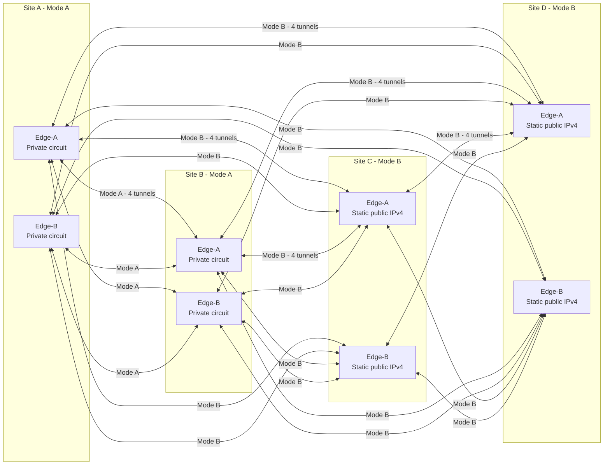

# WAN Transport Abstraction Diagram

Shows the two supported transport modes for inter-site IPsec tunnels. The IPsec overlay and all internal architecture are identical in both modes. Only the underlay transport differs.

## Mode Comparison

## Protocol Stack per Mode

## Per-Site-Pair Tunnel Detail

Each site pair maintains four independent IPsec tunnels — two matched-pair and two cross-connect. All four are held established at all times.

With 4 sites (6 site pairs) × 4 tunnels each = **24 tunnels total** in the full fabric.

## Full-Mesh Multi-Tunnel View

All edge nodes shown explicitly. Each line represents one IPsec tunnel.

## Mixed-Mode Full-Mesh Example

Sites can run different transport modes simultaneously. The 4-tunnel-per-pair model applies regardless of transport mode.

All tunnels carry IPsec AES-256-GCM with IKEv2 regardless of the underlay. IPv6 ULA routes are reachable from every site through any tunnel mode.

## Key Parameters

| Parameter | Mode A | Mode B |
|---|---|---|
| Outer protocol | IPv6 or IPv4 (provider handoff) | IPv4 (static public address) |
| ESP passthrough | Native | Required (protocol 50 or UDP 4500) |
| NAT-T | Not required | Required if behind NAT or CGN |
| Inner MTU | Provider-confirmed (aim 1400+) | ~1400 bytes (1500 minus IPv4+ESP overhead) |
| Reliability | Carrier SLA | Best-effort |
| Underlay isolation | Private circuit + IPsec | IPsec only |
