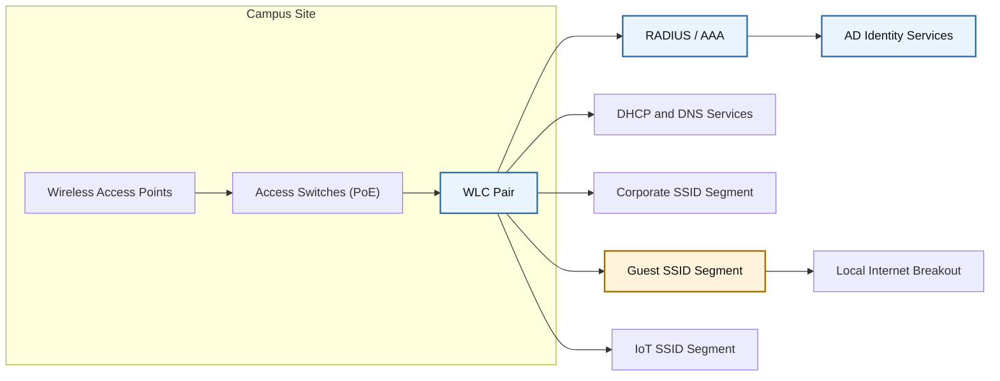

# WLC and WAP Topology

Reference topology for wireless controllers, access points, and SSID policy paths.

```mermaid
flowchart LR
  subgraph CAMPUS["Campus Site"]
    APS["Wireless Access Points"] --> ACCESS["Access Switches (PoE)"]
    ACCESS --> WLC["WLC Pair"]
  end

  WLC --> AAA["RADIUS / AAA"]
  AAA --> ID["AD Identity Services"]
  WLC --> DHCP["DHCP and DNS Services"]

  WLC --> CORP["Corporate SSID Segment"]
  WLC --> GUEST["Guest SSID Segment"]
  WLC --> IOT["IoT SSID Segment"]
  GUEST --> INET["Local Internet Breakout"]

  style WLC fill:#EAF4FF,stroke:#2E6DA4,stroke-width:2px,color:#111111
  style GUEST fill:#FFF4DB,stroke:#A56A00,stroke-width:2px,color:#111111
  style AAA fill:#EAF4FF,stroke:#2E6DA4,stroke-width:2px,color:#111111
  style ID fill:#EAF4FF,stroke:#2E6DA4,stroke-width:2px,color:#111111
  linkStyle default color:#CC5500
```
