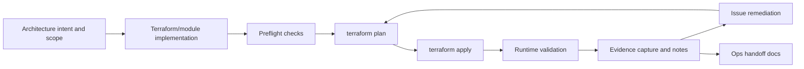
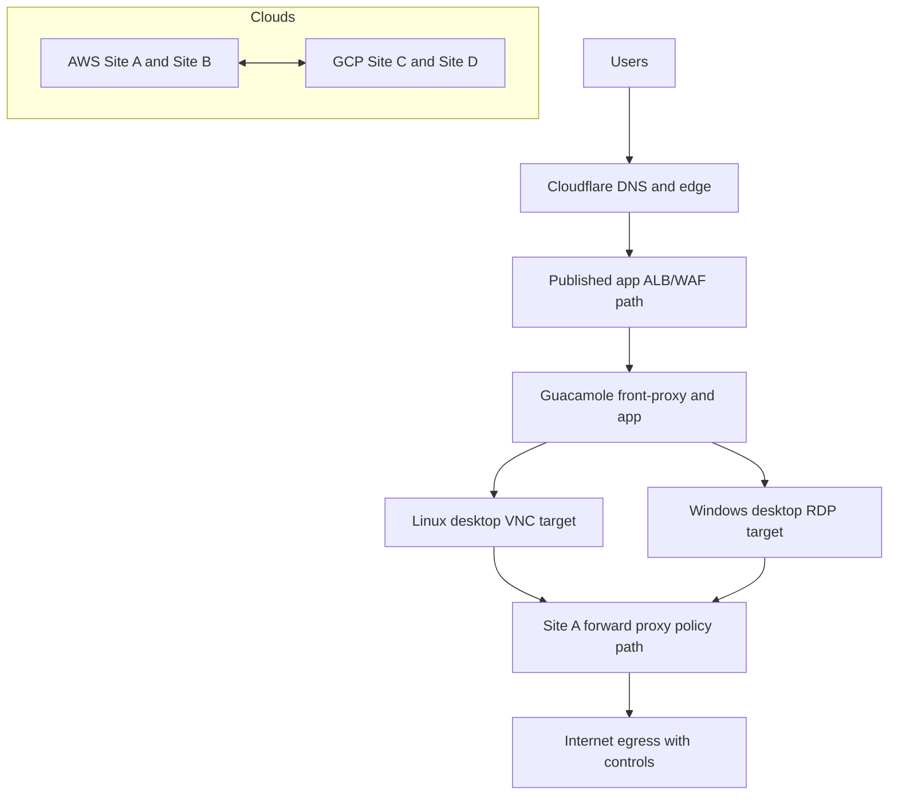

# Implementation Build Report - Dual-Cloud Four-Site Platform

## Report Purpose
This report documents how the dual-cloud four-site environment was built, validated, and iterated from source architecture through live implementation. It is written as an operator-facing build record so a new engineer can understand what was done, why it was done, and how to reproduce the process safely.

Report date: 2026-03-08  
Build scope period: 2026-03-06 to 2026-03-08

## Source Documents Used
- [Implementation Proposal](readme.md)
- [Dual-Cloud Four-Site Proposal](proposal_dual_cloud_4site.md)
- [Phase 5 Resilience and Handover](phase5_resilience_handover.md)
- [Diagram Index](../03_diagrams/diagram_index.md)
- [Failover Scenarios](../04_failover_dr/failover_scenarios.md)
- [DR Test Plan](../04_failover_dr/test_plan.md)
- [RTO/RPO Targets](../04_failover_dr/rto_rpo_targets.md)

## Build Method (Process We Followed)

Key process rules used during the build:
- Change was phase-gated and validated in order (network -> intercloud -> platform -> service onboarding -> VDI/app edge).
- Terraform and Kubernetes changes were validated after each pass before moving to the next pass.
- Runtime issues were captured with root cause and remediation in `iac/terraform/SESSION_NOTES.md`.
- Secrets and tokens were redacted from documentation and committed files.

## Diagram-Led Design and Execution
The build was driven by diagram-to-implementation mapping, not ad-hoc provisioning.

| Diagram | Used For | Build Decision It Drove |
|---|---|---|
| [Dual-Cloud 4-Site Topology](../03_diagrams/dual_cloud_4site_topology.mmd.md) | site placement and cloud/region pairing | fixed site map (A/B AWS, C/D GCP) and region-level deployment alignment |
| [BGP Routing and Prefix Advertisement](../03_diagrams/routing_bgp.mmd.md) | inter-site path policy | primary/failover route preference matrix for intercloud links |
| [WAN Transport Modes](../03_diagrams/wan_transport.mmd.md) | resilient transport assumptions | IPsec + BGP design with path failover behavior |
| [VDI Service Architecture](../03_diagrams/vdi_service.mmd.md) | Guacamole reference stack | VDI broker/service model, Linux VNC + Windows RDP target strategy |
| [Published App Flows](../03_diagrams/published_apps_flow.mmd.md) | external app access path | WAF + ALB + health-gated target flow and DNS edge mapping |
| [Backup and DR Flow](../03_diagrams/backup_dr.mmd.md) and [Failover Matrix](../03_diagrams/failover_matrix.mmd.md) | resilience design | Phase 5 evidence/DR drill planning and handover criteria |

## What Was Built (By Delivery Phase)

### Phase 1 - Per-Site Foundation
- AWS and GCP site network boundaries and subnet baselines were implemented in Terraform.
- Addressing and site summaries were standardized for repeatable rollout.
- Baseline outputs and network IDs were captured for downstream phases.

### Phase 2 - Intercloud Activation
- Intercloud VPN/BGP resources were implemented and exercised with primary and failover preferences.
- Route policy behavior was validated and documented.
- Phase 2 controls were made toggleable with `phase2_enable_intercloud`.

### Phase 3 - Platform Baseline
- EKS/GKE control plane baseline was implemented under phase controls.
- API access hardening was applied for operator CIDRs and private endpoint posture.
- Platform health and status checks were scripted and repeatable.

### Phase 4 - Service Onboarding and Access Plane
- Worker capacity onboarding for AWS/GCP was implemented with phase guards.
- Published app edge path (WAF/LB/health gating) was implemented with Terraform controls.
- Cloudflare DNS/TLS automation path was integrated and validated where enabled.
- VDI reference stack was implemented:
  - Guacamole + Postgres runtime on EKS,
  - Linux desktop path (VNC),
  - Windows desktop path (RDP),
  - user-to-connection permission seeding.
- Slothkko portal and Guacamole theming were integrated into the front-proxy path.
- Controlled browsing forward proxy (Site A Squid) was implemented with client CIDR policy and domain controls.
- Ops server stack patterns (OpenProject/Git/Ansible) and Guacamole connection seeding flow were implemented in phase controls.

### Phase 5 - Resilience Runtime Pack
- Phase 5 evidence capture workflow was implemented via:
  - `iac/terraform/scripts/invoke_phase5_evidence_capture.ps1`
- Evidence artifacts and execution templates were generated under:
  - `iac/terraform/evidence/phase5-<timestamp>/`
- Terraform phase-tracking flags were wired for resilience, backup/restore, and handover readiness.

## Runtime Architecture Implemented

## Implementation Workflow in Practice

### 1) IaC authoring and controls
- Terraform modules were used for reusable site and phase components.
- Feature rollout was controlled through explicit phase flags in `terraform.tfvars`.
- Validation gates used:
  - `terraform fmt`
  - `terraform validate`
  - `terraform plan` before apply

### 2) Scripted operations and rollout safety
- Helper scripts in `iac/terraform/scripts/` were used for repeatable bring-up/down and service bootstrap.
- Preflight and health checks were used before expensive or risky applies.
- Quota and provider constraints were handled through selective phase toggles and safe defaults.

### 3) Kubernetes service bootstrap
- Guacamole stack and VDI desktop manifests were applied through scripted bootstrap workflow.
- Runtime checks included rollout status, pod health, tunnel logs, and connection history.
- User/connection permission seeding was handled via SQL automation against Guacamole DB.

### 4) Edge and DNS/TLS integration
- Edge path and DNS/TLS behavior were validated with HTTP probes and record inspection.
- Root portal and login branding were injected at the front-proxy layer.
- Cloudflare and origin/TLS alignment issues were resolved with cert scope and record updates.

## Major Incidents and How They Were Resolved

### Provider alias mismatch during proxy rollout
- Symptom: Terraform plan/apply failed with unaliased AWS provider credential error.
- Root cause: one IAM policy document data source in forward-proxy code lacked explicit aliased provider.
- Resolution: set `provider = aws.site_a` on that data source and re-run plan/apply.

### Guacamole branding pass caused placeholder deployment regression
- Symptom: direct Kubernetes apply introduced `InvalidImageName` due template placeholders.
- Root cause: applying template manifest directly without rendered image/secret values.
- Resolution:
  - restored deployment images to known-good ECR references,
  - restored Guacamole DB secret values,
  - rolled deployments,
  - re-seeded users/connections/permissions.

### Windows RDP session instability
- Symptom: repeated failed or hung Windows sessions in Guacamole.
- Investigation: tunnel history + guacd logs + network reachability + RDP parameter review.
- Resolution:
  - reset RDP profile to low-complexity known-good settings,
  - restarted Guacamole deployment to clear stale tunnels,
  - recycled Windows instance state,
  - revalidated reachability and connection data.

## Reproducible Build Path (Operator Onboarding)
Use this order for repeatable delivery:

1. Review source docs and diagrams:
   - `docs/10_implementation/readme.md`
   - `docs/03_diagrams/diagram_index.md`
2. Initialize and validate Terraform:
   - `iac/terraform/terraform.tfvars` from example
   - `terraform init`, `terraform validate`, `terraform plan`
3. Bring up platform phases with helper scripts:
   - `scripts/invoke_dev_environment_up.ps1`
   - `scripts/invoke_phase4_vdi_enablement.ps1`
4. Bootstrap VDI services and connections:
   - `scripts/invoke_phase4_vdi_ecr_image_mirror.ps1`
   - `scripts/invoke_phase4_vdi_service_bootstrap.ps1`
5. Apply edge/DNS/TLS and verify external paths.
6. Capture evidence and update operational notes:
   - `scripts/invoke_phase5_evidence_capture.ps1`
   - `iac/terraform/SESSION_NOTES.md`

Important operator safety note:
- Do not apply templated manifests directly if they include unresolved placeholders (`__...__`). Always use the rendering/bootstrap script path or a rendered manifest artifact.

## Evidence and Documentation Outputs
- Session execution log and remediation history:
  - `iac/terraform/SESSION_NOTES.md`
- Phase 5 evidence artifacts:
  - `iac/terraform/evidence/phase5-<timestamp>/`
- Terraform outputs for runtime metadata:
  - `phase4_vdi_desktops`
  - `phase4_forward_proxy`
  - phase deliverable flags

## Remaining Source-Defined Next Feature Set
Per implementation source docs, the next formal feature set is Phase 5 completion:
- execute targeted failover scenarios,
- execute backup/restore drills against RTO/RPO targets,
- complete cross-team runbook handover sign-off.

References:
- [Phase 5 Resilience and Handover](phase5_resilience_handover.md)
- [Failover Scenarios](../04_failover_dr/failover_scenarios.md)
- [DR Test Plan](../04_failover_dr/test_plan.md)
- [RTO/RPO Targets](../04_failover_dr/rto_rpo_targets.md)
